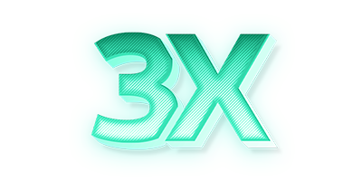

[English](/README.md) | [فارسی](/README.fa_IR.md) | [العربية](/README.ar_EG.md) | [中文](/README.zh_CN.md) | [Español](/README.es_ES.md) | [Русский](/README.ru_RU.md) | [Türkçe](/README.tr_TR.md)

<p align="center">
  <picture>
    <source media="(prefers-color-scheme: dark)" srcset="./media/3x-ui-dark.png">
    
  </picture>
</p>

<p align="center">
  <a href="https://github.com/exhxx-tg/3x-ui-multiport/releases"></a>
  <a href="https://github.com/exhxx-tg/3x-ui-multiport/actions"></a>
  <a href="#"></a>
  <a href="https://github.com/exhxx-tg/3x-ui-multiport/releases/latest"></a>
  <a href="https://www.gnu.org/licenses/gpl-3.0.en.html"></a>
  <a href="https://pkg.go.dev/github.com/exhxx-tg/3x-ui-multiport"></a>
  <a href="https://goreportcard.com/report/github.com/exhxx-tg/3x-ui-multiport"></a>
</p>

**X-UI PRO (3x-ui-multiport)** یک پنل کنترل وب پیشرفته و متن‌باز برای مدیریت یکپارچه **۱۳ پروتکل** — ترکیبی از [Xray-core](https://github.com/XTLS/Xray-core)، سرویس‌های مستقل VPN و لایه‌های حمل‌ونقل (Transport Wrappers) در یک رابط مدیریت واحد. این پنل یک داشبورد تمیز و چندزبانه برای استقرار، پیکربندی، نظارت و امنیت پروتکل‌های پراکسی و VPN ارائه می‌دهد — از یک VPS تکی تا استقرارهای چندنودی.

X-UI PRO به‌عنوان نسخه‌ای توسعه‌یافته از 3X-UI ساخته شده و ۸ پروتکل اضافی، امنیت در سطح سازمانی، نظارت جامع و ابزارهای DevOps آماده تولید را اضافه می‌کند.

> [!IMPORTANT]
> این پروژه فقط برای استفاده شخصی در نظر گرفته شده است. لطفاً از آن برای اهداف غیرقانونی یا در محیط تولید استفاده نکنید.

## اکوسیستم ۱۳ پروتکل

### 🔹 پروتکل‌های پایه (Xray-native)
| پروتکل | توضیحات | منبع |
|---|---|---|
| **VMess** | پراکسی شبیه Socks5 با رمزنگاری | Xray-core |
| **VLESS** | نسخه سبک VMess بدون سربار رمزنگاری | Xray-core |
| **Trojan** | پروتکل مبتنی بر TLS شبیه HTTPS | Xray-core |
| **Shadowsocks** | Socks5 ساده با رمزنگاری جریان | Xray-core |
| **Hysteria** | پروتکل UDP بهینه‌شده برای سرعت | Xray-core |

### 🔹 سرویس‌های مستقل
| سرویس | توضیحات | منبع |
|---|---|---|
| **OpenVPN** | VPN استاندارد صنعتی (TCP/UDP) | OpenVPN |
| **WireGuard** | VPN مدرن مبتنی بر هسته | WireGuard |
| **Dropbear** | سرور SSH سبک | Dropbear |

### 🔹 لایه‌های حمل‌ونقل (Transport Wrappers)
| لایه | توضیحات | سازگار با |
|---|---|---|
| **WebSocket** | تونل WebSocket HTTP | VMess, VLESS, SS, Trojan |
| **TLS/HTTPS** | حمل‌ونقل رمزنگاری‌شده با TLS | VMess, VLESS, SS, Trojan |
| **HTTP/2** | حمل‌ونقل مالتی‌پلکس HTTP/2 | VLESS, Trojan |
| **gRPC** | لفافه پروتکل gRPC | VLESS, Trojan |
| **Naive** | تونل HTTP CONNECT | تمام پروتکل‌ها |

## ویژگی‌ها

- **۱۳ پروتکل** — ۵ پایه + ۳ سرویس مستقل + ۵ لایه حمل‌ونقل
- **امنیت سازمانی** — RBAC، ۲FA، لاگ حسابرسی، کنترل IP، محدودیت نرخ
- **نظارت جامع** — بررسی سلامت، معیارها، هشدارها، Prometheus
- **بهینه‌سازی عملکرد** — استخر کارگران، کش حافظه، استخر اتصالات DB
- **ابزار خط فرمان** — مدیریت کامل پروتکل‌ها از ترمینال
- **پشتیبانی Kubernetes** — مانیفست‌های کامل K8s
- **۱۳ زبان رابط کاربری** با تم تیره و روشن

## شروع سریع — یک کد نصب، همه چیز آماده

### 🐧 سرور معمولی (Bare Metal)
```bash
bash <(curl -Ls https://raw.githubusercontent.com/exhxx-tg/3x-ui-multiport/main/install.sh)
```
> بعد نصب: `http://your-server-ip:2053` یا دستور `x-ui` در ترمینال.

### 🐳 Docker (پیشنهادی)
```bash
docker run -d --name x-ui --restart unless-stopped --cap-add=NET_ADMIN --cap-add=NET_RAW -p 2053:2053 -v x-ui-db:/etc/x-ui ghcr.io/exhxx-tg/3x-ui-multiport:latest
```
> باز کنید: `http://your-server-ip:2053`

### ☸️ Kubernetes
```bash
kubectl apply -k https://github.com/exhxx-tg/3x-ui-multiport/deploy/k8s
```

### ⚡ نصب بدون دخالت
```bash
XUI_NONINTERACTIVE=1 bash <(curl -Ls https://raw.githubusercontent.com/exhxx-tg/3x-ui-multiport/main/install.sh)
```

مستندات کامل: [docs/](docs/)

## پلتفرم‌های پشتیبانی‌شده

**سیستم‌عامل‌ها:** Ubuntu، Debian، Armbian، Fedora، CentOS، RHEL، AlmaLinux، Rocky Linux، Oracle Linux، Amazon Linux، Virtuozzo، Arch، Manjaro، Parch، openSUSE، Alpine و Windows.

**معماری‌ها:** `amd64` · `386` · `arm64` (aarch64) · `armv7` · `armv6` · `armv5` · `s390x`.

## زبان‌های پشتیبانی‌شده

English · فارسی · العربية · 中文（简体） · 中文（繁體） · Español · Русский · Українська · Türkçe · Tiếng Việt · 日本語 · Bahasa Indonesia · Português (Brasil)

## مشارکت

از مشارکت‌ها استقبال می‌شود. لطفاً [راهنمای مشارکت](/CONTRIBUTING.md) را مطالعه کنید.

## تشکر ویژه

- [alireza0](https://github.com/alireza0/)
- [MHSanaei](https://github.com/MHSanaei/) — پروژه اصلی 3X-UI

## حمایت از پروژه

**اگر این پروژه برای شما مفید است، به آن یک**:star2: بدهید

[](https://starchart.cc/exhxx-tg/3x-ui-multiport)
